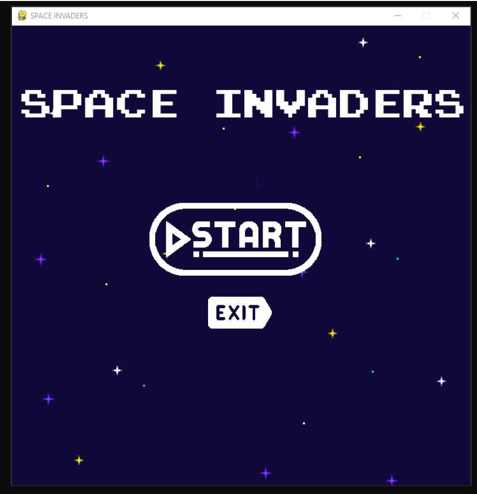

# Space Invaders - Juego Arcade en Python

Este proyecto es una recreación del clásico juego arcade "Space Invaders", programado en Python utilizando la librería Pygame. El objetivo del juego es eliminar a los enemigos antes de que lleguen al borde inferior de la pantalla. El jugador puede seleccionar entre tres niveles de dificultad y al finalizar la partida se guarda la puntuación obtenida junto con su nombre. 

## Características del Juego

- **Menú Principal**: Opciones para iniciar el juego o salir.
- **Selección de Dificultad**: Tres niveles de dificultad, donde los enemigos se mueven a diferentes velocidades.
- **Controles**:
  - Mover la nave: Flechas izquierda y derecha
  - Disparar: Barra espaciadora
- **Sistema de Puntajes**: Al finalizar la partida, la puntuación obtenida se almacena junto con el nombre del jugador. Las cinco mejores puntuaciones se muestran en la pantalla de "Game Over".
- **Instrucciones**: Una pantalla adicional de instrucciones accesible desde el menú de selección de niveles.

### Menú Principal

## Requisitos

- Python 3.x
- Librería Pygame

## Archivos

AUNQUE LOS ARCHIVOS VENGAN ORGANIZADOS EN CARPETAS, PARA SU EJECUCIÓN DEBEN ENCONTRARSE TODOS EN UNA SOLA CARPETA, A UN MISMO NIVEL.

- SpaceInvaders.py: Contiene el código principal del juego.
- InformeSpaceInvaders: Informe detallado del programa completo.
- cinco_máximos.py: Módulo auxiliar que gestiona el almacenamiento y recuperación de las cinco puntuaciones más altas.
- Carpeta Imágenes: Contiene las imágenes empleadas para el diseño gráfico del juego.
- Carpeta Audios: Contiene los archivos de audio para los sonidos integrados en el juego.
- Carpeta Archivos: Contiene los ficheros con las tipografías, información del juego y el fichero de almacenamiento de puntuaciones.
- Carpeta Imágenes de Funcionamiento: Contiene capturas de pantalla de su ejecución.

## Cómo Jugar

- Ejecuta el archivo SpaceInvaders.py.
- Ingresa tu nombre al iniciar el juego.
- Selecciona el nivel de dificultad.
- Usa las flechas izquierda y derecha para mover la nave y la barra espaciadora para disparar.
- El objetivo es eliminar a los enemigos antes de que lleguen al borde inferior. Si un enemigo toca la nave, el juego termina. Si un enemigo pasa sin ser eliminado, se restan puntos.

## Referencias

- Código de referencia inicial: https://www.youtube.com/watch?v=Q-__8Xw9KTM&t=3710s
- Fuente de las imágenes: flaticon.es
- Canción de fondo: "Back on Track" de DJVI empleado en el juego Geometry Dash

